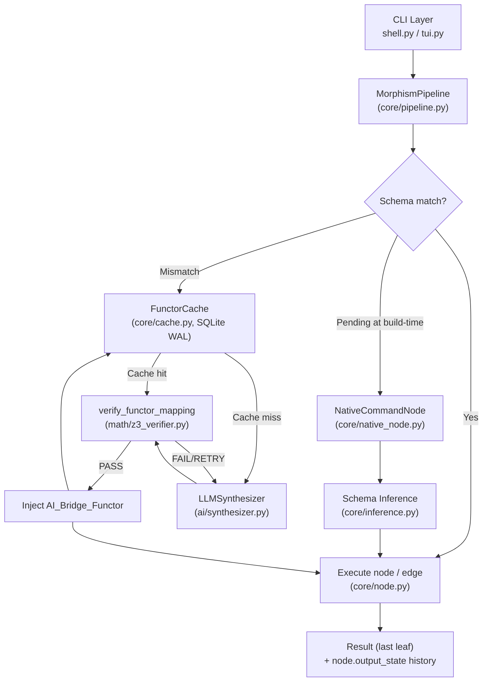

<p align="center">
  <strong>Morphism Engine</strong><br>
  <em>The CLI that Proves its Work.</em>
</p>

<p align="center">
  
  
  
  
  
  
</p>

<p align="center">
  <a href="https://www.linkedin.com/company/morphismengine">LinkedIn: @morphismengine</a> •
  <a href="https://www.instagram.com/morphismengine">Instagram: @morphismengine</a>
</p>

---

## Table of Contents

- [Description](#description)
- [Features](#features)
- [Installation](#installation)
- [Quick Start](#quick-start)
- [How It Works (Architecture)](#how-it-works-architecture)
- [Architecture](#architecture)
- [Testing](#testing)
- [Requirements](#requirements)
- [Acknowledgements](#acknowledgements)
- [Contact / Maintainer](#contact--maintainer)
- [License](#license)

---

## Description

### What problem it solves

Morphism solves unsafe boundary composition in CLI/data pipelines. Traditional pipes do not enforce schema compatibility between stages, so invalid transformations are often discovered only at runtime after damage or silent corruption.

### Why it exists

It exists to make pipeline composition verifiable, inspectable, and resilient. Instead of relying on ad hoc glue code for every type mismatch, Morphism automates repair and safety checks using a typed DAG model.

### What makes it unique

- Formal verification gates candidate transforms before execution.
- LLM synthesis is used as a bounded generation engine, not as a trust boundary.
- Verified transforms are cached and reused, reducing repeated synthesis cost.
- Interactive REPL and Textual TUI expose internals (DAG, telemetry, node state) while running.

---

## The Problem

POSIX pipes (`|`) are **untyped**. When you write:

```bash
cat users.json | tr ',' '\n' | wc -l
```

Nothing guarantees the output of `tr` is valid input for `wc -l` in any meaningful sense. One malformed byte and the entire pipeline fails silently — or worse, produces wrong results. There are no schemas, no contracts, and no safety nets.

## The Solution

**Morphism Engine** replaces "hope-based piping" with **mathematically guaranteed type safety**.

Every node in a Morphism pipeline carries a **typed schema** (e.g., `Int_0_to_100`, `Float_Normalized`, `JSON_Object`). When two adjacent nodes disagree on types, the engine:

1. **Detects** the mismatch at link-time.
2. **Synthesises** a bridge functor using a local **Ollama** LLM.
3. **Proves** the bridge is safe via the **Z3 SMT theorem prover** — if Z3 can't prove it, the bridge is rejected. No exceptions.
4. **Caches** the proven functor in a zero-latency **SQLite store** so it's never re-synthesised.
5. **Executes** the repaired pipeline end-to-end.

The result: a shell where **every pipe connection is a formally verified morphism** in the category-theoretic sense.

---

## Features

- Formal verification using Z3 before bridge insertion.
- LLM-powered logic synthesis for schema mismatch repair.
- Persistent logic caching with SQLite WAL and schema-pair hashing.
- Interactive TUI interface with DAG topography and live telemetry.
- Native subprocess integration with runtime schema inference.
- True lazy streaming execution via async generators (`execute_all_stream`).
- Parallel fan-out branching via `|+` using `asyncio.gather`.

### Feature matrix

| Feature | Description |
|---|---|
| **Self-Healing Pipelines** | Schema mismatches are autonomously repaired by AI synthesis + Z3 proof. |
| **Dynamic Schema Inference** | Native subprocesses (`echo`, `curl`, `python -c`) get their output schema inferred at runtime — JSON, CSV, or plaintext. |
| **Zero-Latency Functor Cache** | SQLite WAL-mode cache with SHA-256 keying. A proven bridge is never synthesised twice. |
| **True Lazy Streaming** | Native command nodes stream stdout in chunks and pipelines can execute as async streams without buffering full payloads in memory. |
| **DAG Branching (`\|+`)** | Fan-out a single node to multiple children with `emit_raw \|+ (render_float, to_sql)`. Parallel execution via `asyncio.gather`. |
| **Reactive Textual TUI** | 3-column layout: searchable Tool Catalog, live DAG Topographer tree, node Inspector, and streaming Telemetry log. |
| **Intelligent Autocomplete** | Pipe-aware command suggestions that reset after every `\|` token. |
| **Non-Blocking Execution** | Pipeline runs inside a Textual `@work` worker — the UI never freezes, even during long Ollama calls. |

---

## Installation

### 1. Clone & install

```bash
git clone https://github.com/Tejo0507/morphism-engine.git
cd morphism-engine
pip install -e ".[dev]"
```

This installs three console commands:

| Command | Interface |
|---|---|
| `morphism-engine` | Textual TUI (recommended) |
| `morphism-tui` | Textual TUI (alias) |
| `morphism` | Classic `cmd.Cmd` REPL |

### 2. Pull the Ollama model

The self-healing synthesiser requires a local LLM. Install [Ollama](https://ollama.com), then:

```bash
ollama pull qwen2.5-coder:1.5b
```

### 3. Verify

```bash
pytest tests/ -v
```

All **73 tests** should pass.

---

## Quick Start

### Launch the TUI

```bash
morphism-engine
```

### Run a linear pipeline

Type in the command bar:

```
emit_raw | render_float
```

`emit_raw` outputs an `Int_0_to_100` value. `render_float` expects `Float_Normalized`. The engine detects the mismatch, synthesises a bridge (`x / 100.0`), proves it with Z3, and executes the full chain.

### Fan-out with DAG branching

```
emit_raw |+ (render_float, render_float)
```

The output of `emit_raw` fans out to two parallel `render_float` nodes, executed concurrently.

### Run native subprocesses

```
echo {"name":"Ada"} | python -c "import sys,json; print(json.load(sys.stdin)['name'])"
```

Morphism infers `JSON_Object` for the first node and `Plaintext` for the second, auto-bridging as needed.

### Stream giant payloads without buffering

For large outputs (multi-GB files, continuous streams), use the streaming API:

```python
import asyncio

from morphism.ai.synthesizer import MockLLMSynthesizer
from morphism.core.pipeline import MorphismPipeline

async def main() -> None:
    pipeline = MorphismPipeline(llm_client=MockLLMSynthesizer())
    # Build nodes with append(...)
    stream = await pipeline.execute_all_stream(None)
    async for chunk in stream:
        # Process each chunk incrementally
        pass

asyncio.run(main())
```

`execute_all` remains available for compatibility when you want a fully materialized final value.

---

## How It Works (Architecture)

At a high level, Morphism coordinates five runtime components:

- **UI layer**: REPL (`morphism`) and Textual TUI (`morphism-engine` / `morphism-tui`).
- **Pipeline core**: typed DAG orchestration (`MorphismPipeline`, `FunctorNode`, `NativeCommandNode`).
- **Synthesis layer**: LLM candidate generation (`LLMSynthesizer`, Ollama backend, mock backend for deterministic tests).
- **Verification layer**: Z3-backed proof checks plus runtime postcondition fallback for non-numeric domains.
- **Persistence layer**: SQLite functor cache keyed by schema-pair hash.

### Data flow

1. Parse pipeline and build graph edges.
2. Validate schema boundaries at append/runtime.
3. On mismatch, check cache for existing bridge.
4. On miss, synthesize candidate transform.
5. Compile and verify candidate.
6. If safe, inject bridge and cache it; if not, retry/fail closed.
7. Execute DAG and expose output plus per-node state.

### Design philosophy

- **Fail closed**: rejected or unverified transforms must never execute.
- **Trust after proof**: cache hits are revalidated before reuse.
- **Observability first**: telemetry/logs and node inspection are part of normal operation.
- **Composable internals**: each layer has a narrow role and explicit contracts.

---

## Architecture

### System architecture (Mermaid)



### System architecture (ASCII)

```
                        Morphism Engine — Under the Hood
  ┌─────────────────────────────────────────────────────────────────────┐
  │                                                                     │
  │   User Input                                                        │
  │       │                                                             │
  │       ▼                                                             │
  │   ┌─────────┐     ┌──────────────┐     ┌─────────────┐             │
  │   │  Parse  │────▶│  Link Nodes  │────▶│  Schema     │             │
  │   │  (| |+) │     │  (DAG build) │     │  Check      │             │
  │   └─────────┘     └──────────────┘     └──────┬──────┘             │
  │                                               │                     │
  │                              ┌────────────────┼────────────────┐    │
  │                              │  Match?        │  Mismatch?     │    │
  │                              ▼                ▼                │    │
  │                         ┌─────────┐    ┌─────────────┐        │    │
  │                         │  Exec   │    │ Cache Check  │        │    │
  │                         │  as-is  │    │ (SQLite)     │        │    │
  │                         └─────────┘    └──────┬──────┘        │    │
  │                                               │                │    │
  │                                   ┌───────────┼──────────┐     │    │
  │                                   │ HIT       │ MISS     │     │    │
  │                                   ▼           ▼          │     │    │
  │                             ┌──────────┐ ┌──────────┐    │     │    │
  │                             │ Load     │ │ AI Synth │    │     │    │
  │                             │ Cached   │ │ (Ollama) │    │     │    │
  │                             │ Functor  │ └────┬─────┘    │     │    │
  │                             └────┬─────┘      │          │     │    │
  │                                  │            ▼          │     │    │
  │                                  │      ┌──────────┐     │     │    │
  │                                  │      │ Z3 Proof │     │     │    │
  │                                  │      │ (SMT)    │     │     │    │
  │                                  │      └────┬─────┘     │     │    │
  │                                  │           │           │     │    │
  │                                  │    ┌──────┴──────┐    │     │    │
  │                                  │    │PASS?  FAIL? │    │     │    │
  │                                  │    ▼       ▼     │    │     │    │
  │                                  │  Cache   Retry/  │    │     │    │
  │                                  │  Store   Reject  │    │     │    │
  │                                  │    │             │    │     │    │
  │                                  ▼    ▼             │    │     │    │
  │                            ┌──────────────┐         │    │     │    │
  │                            │  JIT Execute │         │    │     │    │
  │                            │  (pipeline)  │         │    │     │    │
  │                            └──────┬───────┘         │    │     │    │
  │                                   │                 │    │     │    │
  │                                   ▼                 │    │     │    │
  │                              ┌──────────┐           │    │     │    │
  │                              │  Output  │           │    │     │    │
  │                              └──────────┘           │    │     │    │
  │                                                     │    │     │    │
  │                              ───────────────────────┘────┘─────┘    │
  └─────────────────────────────────────────────────────────────────────┘
```

### Key modules

| Module | Purpose |
|---|---|
| `morphism.core.pipeline` | Async DAG executor with `asyncio.gather` fan-out |
| `morphism.core.node` | `FunctorNode` — DAG vertex with typed schemas |
| `morphism.core.schemas` | `Schema` dataclass + built-in instances |
| `morphism.core.cache` | `FunctorCache` — SQLite WAL + SHA-256 keying |
| `morphism.core.native_node` | `NativeCommandNode` — OS subprocess wrapper |
| `morphism.core.inference` | Runtime schema inference (JSON / CSV / Plaintext) |
| `morphism.ai.synthesizer` | Ollama LLM client for bridge functor generation |
| `morphism.math.z3_verifier` | Z3 SMT proof of generated functors |
| `morphism.cli.tui` | Textual TUI (recommended interface) |
| `morphism.cli.shell` | Classic `cmd.Cmd` REPL (fallback) |

---

## Testing

```bash
# Run the full suite
pytest tests/ -v

# Run only TUI tests
pytest tests/test_phase11_tui.py -v

# Run only cache + DAG tests
pytest tests/test_phase9_10.py -v
```

**73 tests** across 8 test files covering schema verification, self-healing synthesis, native subprocess integration, SQLite cache lifecycle, DAG branching, and headless TUI pilot tests.

---

## Requirements

| Dependency | Version | Purpose |
|---|---|---|
| Python | ≥ 3.11 | Runtime |
| z3-solver | ≥ 4.12 | Formal verification of bridge functors |
| aiohttp | ≥ 3.9 | Async HTTP client for Ollama |
| requests | ≥ 2.31 | Sync HTTP fallback |
| textual | ≥ 0.50 | Reactive terminal UI framework |
| Ollama | latest | Local LLM inference server |

---

## Acknowledgements

- **Z3 SMT Solver** for formal verification.
- **Ollama** for local LLM inference.
- **Textual** for the terminal UI runtime.
- **aiohttp** and **requests** for network integrations.
- The broader category-theory and formal-methods community for core conceptual inspiration.

---

## Contact / Maintainer

- **Maintainer**: Tejo Sridhar M V S
- **GitHub**: https://github.com/Tejo0507
- **Repository**: https://github.com/Tejo0507/morphism-engine
- **Email**: tejosridhar.mvs@gmail.com
- **Instagram**: https://www.instagram.com/me.tejo
- **LinkedIn**: https://www.linkedin.com/in/tejosridhar

---

## License

MIT
